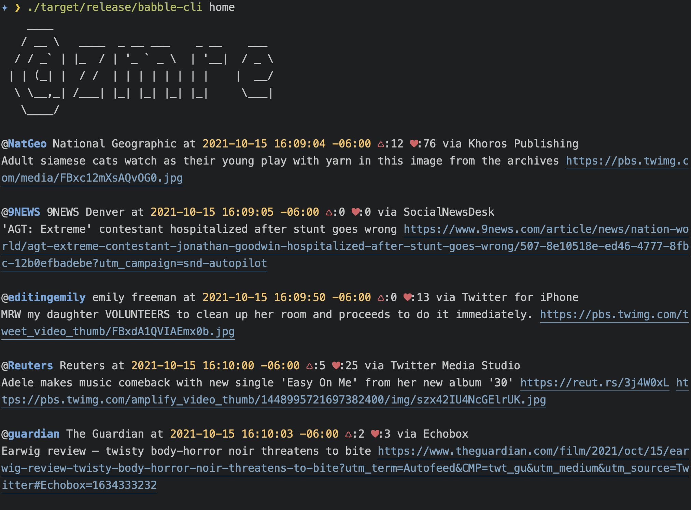

# Babble

## Inspiration

I am a fan of [rainbowstream](https://github.com/orakaro/rainbowstream) as a way to view tweets from the command line, but I've had the following issues:

* It has stopped working for long periods due to twitter API issues
* It has stopped working for other periods because of python dependency hells that are probably just issues on my system.

It's actually working again for the moment, but I started building this while it was broken on my machine.

I like the Tweetbot interface a fair bit. I can put different lists in different columns and keep an eye on local news, security news, and my main feed at one time. With Babble, I wanted to do the same thing inside tmux. Actually, I initially envisioned this as more of a terminal app that could make its own columns, but since I use tmux extensively anyway, I realized I can just use that to manage the windows and then spin this up to show various things as I like in the different panes or windows.

## Current Status

For now, it's mostly meant for my own use. I don't have the right API credentials to publish it. But it wouldn't be hard to do that if folks ask. Just submit an issue.

It also supports markdown output, which is useful for me in conjunction with my notes system so I can capture my own social media activity into a note if I want to.

It also still needs some work to make the code cleaner, but given that it works great for me, that may never happen.

## Usage

On first use, you'll be prompted for a Twitter "consumer key" and a "consumer secret." These are required and you can get them for free by going to [Twitter's Developer Portal](https://developer.twitter.com/en/portal/dashboard) and creating a project. Once setup is out of the way, you can use it:

Here are some of the arguments I use when I run it:

```
babble-cli home
babble-cli list -n Boulder\ News
babble-cli --stream list -n Security
babble-cli --markdown me
```

## Example output with markdown

### **[@TIME](https://twitter.com/TIME)** TIME at 2021-10-15 15:33:00 -06:00 ♺:5 ♥:11 _via Sprinklr_
MIT reckons with early leader's role in forced removal of Native American tribes [ti.me](https://ti.me/3aIP5FS)

### **[@TheArtOfCharm](https://twitter.com/TheArtOfCharm)** The Art of Charm | Communicate powerfully at 2021-10-15 15:33:00 -06:00 ♺:0 ♥:1 _via Sprout Social_
Struggling with a late team member? Instead of saying: "I need this done tomorrow." Try saying: "What would help you get this done tomorrow?" People don't like being told what to do, but they do like solving problems. Who's gonna try this next week? 🙌 **#ArtofCharm** **#Manager**

### **[@ColoradoSun](https://twitter.com/ColoradoSun)** The Colorado Sun at 2021-10-15 15:33:01 -06:00 ♺:0 ♥:3 _via Buffer_
CARTOON | Slavery wasn't an identity, it was something done to mothers, fathers, daughters and sons. [buff.ly](https://buff.ly/30oz1Hb)

### **[@SwiftOnSecurity](https://twitter.com/SwiftOnSecurity)** 🆘 at 2021-10-15 15:33:18 -06:00 ♺:0 ♥:6 _via Twitter for iPhone_
➜ In reply to [tweet by @SwiftOnSecurity](https://twitter.com/SwiftOnSecurity/status/1449123811845197834)
It's one of concerns I have about budget allocations to cybersecurity in government. I can command an all-expenses-paid trip to New York for the chance to talk to me. You need to up your commitment. I'd readily forgo that to serve the common good. You're making it hard. 

### **[@guardian](https://twitter.com/guardian)** The Guardian at 2021-10-15 15:33:26 -06:00 ♺:4 ♥:8 _via Echobox_
New Zealand's weird and wonderful vaccine rollout [www.theguardian.com](https://www.theguardian.com/world/2021/oct/16/new-zealands-weird-and-wonderful-vaccine-rollout?utm_term=Autofeed&CMP=twt_gu&utm_medium&utm_source=Twitter#Echobox=1634322775)

### **[@Reuters](https://twitter.com/Reuters)** Reuters at 2021-10-15 15:35:20 -06:00 ♺:4 ♥:4 _via True Anthem_
Blast at Shi'ite mosque in Afghan city of Kandahar kills dozens [reut.rs](http://reut.rs/3lKTmyR) 


## Example output in the terminal



## TODO

* Allow per-day filter on me
* Get my likes
* Refactor to reuse code better
* Allow for quick preview or launch of URLs by listening for input and maybe labeling URLs with a launch letter or some such
* Allow for easier quitting in stream mode
